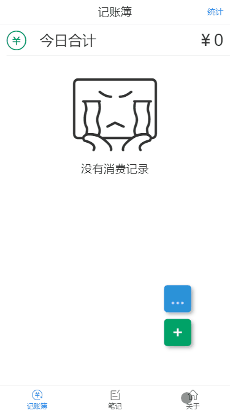
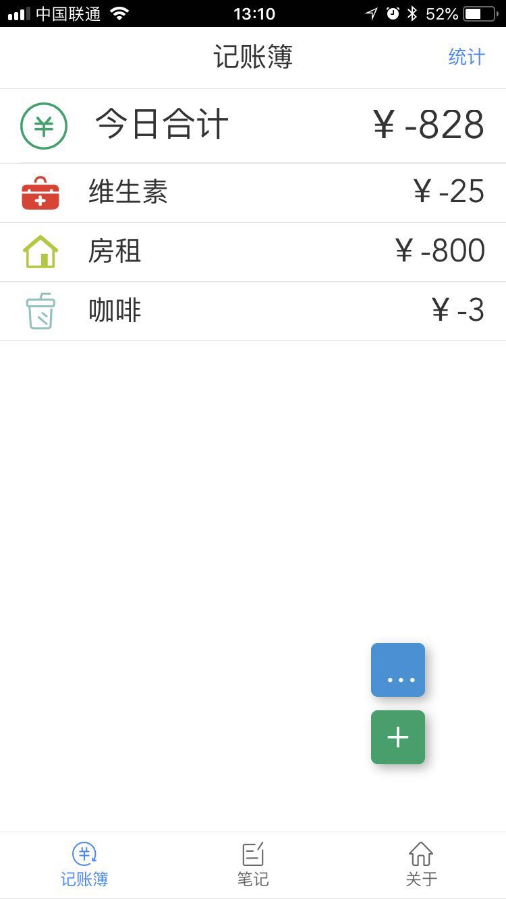
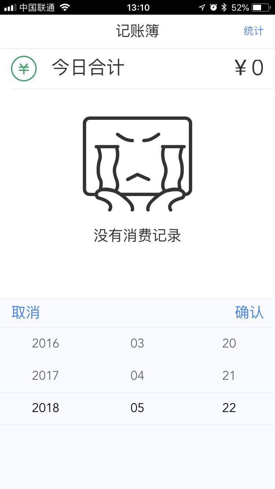
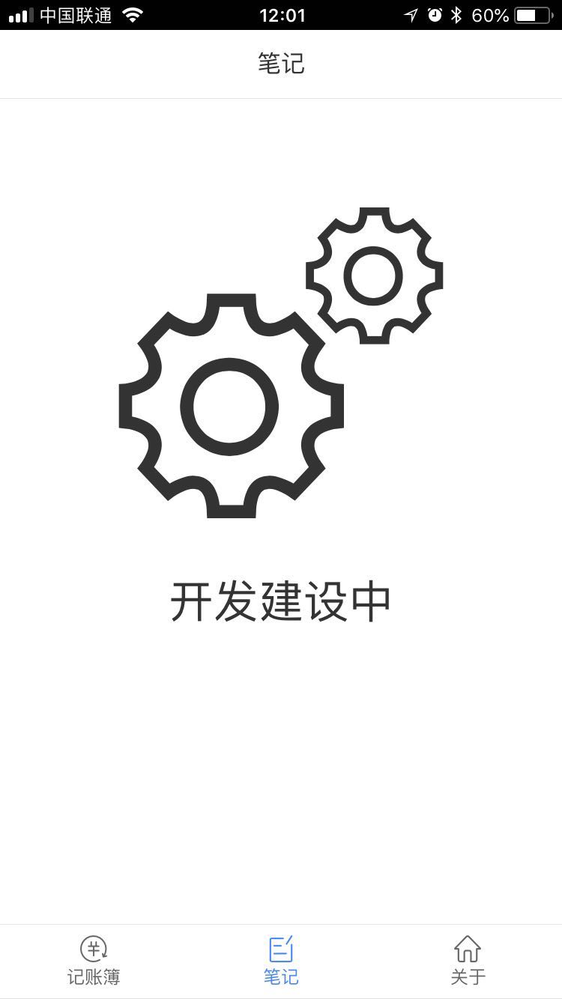
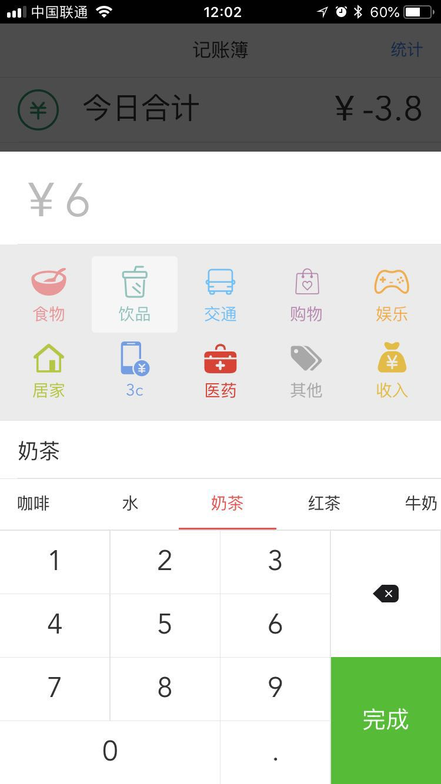

<br>
<p align="center">
  
</p>
<br>

> 一个记账本功能的pwa项目。

## 技术栈

`vue`三件套 = `vue` + `vuex` + `vue-router`

ui = `vant`

本地存储 = `localstorage`

pwa应用和用啥框架没有关系，主要是`service-work`，这里因为`vue`有提供一个pwa的模板所以就直接用了，ui的组件库用了`vant`，这个库专注移动端，像数字键盘等组件还是很不错的。

## 在线地址

可以访问[在线地址](https://limengke123.github.io/#/)，`ios`系统可以添加到桌面使用。
或者扫描二维码：

<p align="center">
  
</p>
<br>


## 图片

gif动图:



<details><summary>一些截图</summary><br>
<br>

<br>
<br>
<br>

<br>
<br>
<br>

<br>
<br>
<br>

<br>
<br>
<br>
</details>

## 待完成

- [X] 时间处理类
- [X] 流水记录(日期查询)
- [X] 分类统计
- [X] 统计报表
- [X] 离线缓存 *安卓支持缓存,ios暂不支持*
- [ ] 闪屏处理
- [ ] icon处理
- [X] 首部、底部icon、文字优化
- [ ] 第二个模块(Note)
- [ ] 第三个模块(About)
- [ ] 模块依赖分析与优化
- [ ] 移动端适配

## 更新记录

### 1.0.2

1. 分类统计
2. 统计报表

---


## 如何开始

``` bash
# 安装依赖
npm install

# 启动服务
npm run dev

# 打包
npm run build

# 带分析报告的打包
npm run build --report
```

## 部署

因为没有涉及到服务相关，所以直接丢到`github page`上面就可以了，而且刚好还是`https`协议符合`pwa`的要求。
